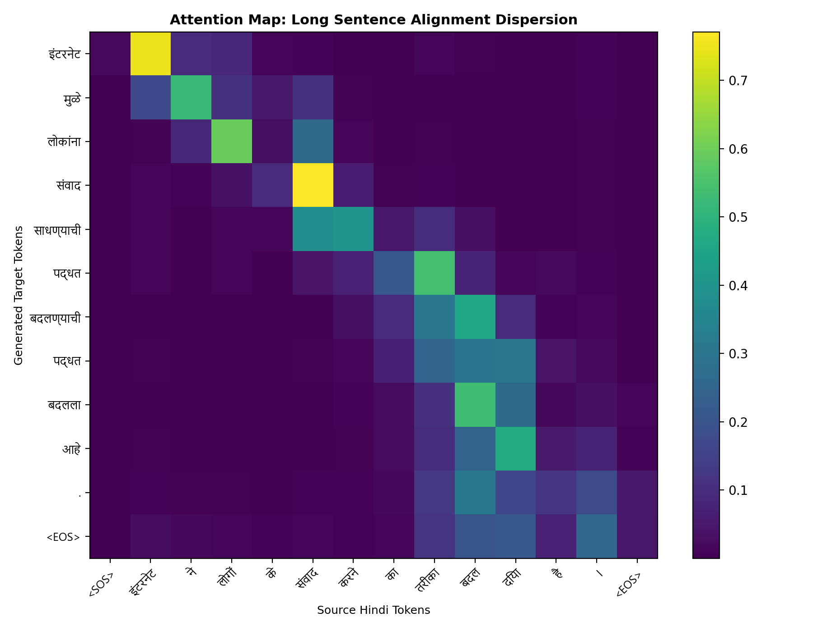

# Hindi → Marathi Neural Machine Translation
## IndicSeq2Seq: A Bidirectional LSTM Seq2Seq Model with Bahdanau Attention

---

## 1. Abstract

This report presents the design, training, and evaluation of **IndicSeq2Seq**, a Neural Machine Translation (NMT) system for translating Hindi to Marathi. The architecture is built on a **2-layer Bidirectional LSTM Encoder** with **Bahdanau (Additive) Attention** and a 2-layer Unidirectional LSTM Decoder. The model is trained on a parallel Hindi-Marathi corpus using a joint **SentencePiece BPE tokenizer** with a vocabulary size of 32,000.

Training was conducted in two phases on Kaggle T4 x2 GPUs: a primary phase over 15 epochs followed by a targeted continuation training phase at a reduced learning rate ending at Epoch 16. The final checkpoint achieves:

- **Validation Loss:** 6.487
- **BLEU (val set):** 7.97
- **CHRF (val set):** 32.41

A key contribution of this work is the systematic optimization of the **inference decoding pipeline**. We identify and resolve the critical problem of repetitive degeneration under greedy decoding through an ablation study comparing four decoding strategies. On an independent 45-sentence qualitative evaluation set, **Beam Search with Repetition Blocking** achieves the best BLEU score of **5.69** and CHRF of **44.63**. Note that validation-set BLEU (7.97) is higher because the val set is drawn from the same distribution as training; the qualitative set is an independently curated, linguistically diverse benchmark.

---

## 2. Introduction

Hindi and Marathi are both Indo-Aryan languages written in the **Devanagari script**. They share a significant portion of vocabulary (cognates), grammatical structure, and script, making the translation task theoretically well-suited for recurrent sequence-to-sequence architectures.

However, Hindi-Marathi MT presents real low-resource challenges:
- Parallel corpora are noisier and smaller than English-centric pairs.
- Both languages have **rich agglutinative morphology** (e.g., verb conjugations, gender, and number agreement).
- Named entities and rare words are undertrained due to corpus sparsity.

This project aims to:
1. Implement a classical Seq2Seq NMT architecture with attention.
2. Train it on a realistic Hindi-Marathi corpus under compute-constrained conditions.
3. Systematically improve inference quality through principled decoding stabilization.
4. Perform a rigorous qualitative failure analysis.

---

## 3. Dataset and Preprocessing

### 3.1 Corpus

We use a parallel Hindi-Marathi corpus aggregated from publicly available Indic NLP sources. The raw corpus contains sentence pairs covering diverse domains including news, literature, and government documents.

| Split | Sentences | Approx. Tokens (Hindi) |
| :--- | :---: | :---: |
| Train | ~710,000 | ~11.5M |
| Validation | ~37,500 | ~600K |

### 3.2 Cleaning Pipeline

Raw sentences undergo the following filtering steps:
- Remove empty or whitespace-only lines.
- Enforce source-target length ratio constraints (remove pairs where `len(src)/len(tgt) > 3.0`).
- Strip excessive punctuation and web-scraping artifacts.
- Deduplicate identical source-target pairs.

### 3.3 Tokenizer: Shared SentencePiece BPE

A critical design decision is using a **joint tokenizer** trained simultaneously on both Hindi and Marathi text.

**Rationale:** Hindi and Marathi share the Devanagari script and a significant portion of root vocabulary. A shared tokenizer allows the model to:
- Learn shared subword embeddings for cognates (e.g., *भारत* appearing identically in both languages).
- Reduce OOV rates significantly compared to separate vocabularies.
- Share embedding parameters between the encoder and decoder.

**Vocabulary size:** 32,000 subword tokens.

### 3.4 Special Token Handling

| Token | ID | Purpose |
| :--- | :---: | :--- |
| `<PAD>` | 0 | Sequence padding |
| `<UNK>` | 1 | Out-of-vocabulary fallback |
| `<SOS>` | 2 | Start-of-sequence decoder prompt |
| `<EOS>` | 3 | End-of-sequence stopping signal |

During training, each source sequence is prepended with `<SOS>` and appended with `<EOS>`. The decoder receives `<SOS>` as the first input token and is trained to generate until `<EOS>`.

---

## 4. Architecture

### 4.1 Overview

```
Hindi Input Tokens
      │
      ▼
┌─────────────────────────────────────────────────────────┐
│  Embedding Layer (32000 × 256)                          │
└─────────────────────────────────────────────────────────┘
      │
      ▼
┌─────────────────────────────────────────────────────────┐
│  Bidirectional LSTM Encoder (2 layers, hidden=512)      │
│  → Forward LSTM  →→→→→→→→→→→→→→→→→                      │
│  ← Backward LSTM ←←←←←←←←←←←←←←←←←                     │
│  Output: Concatenated [forward; backward] → dim=1024    │
└─────────────────────────────────────────────────────────┘
      │
      │  Encoder Outputs (batch, seq_len, 1024)
      │  Hidden/Cell States (projected to dim=512)
      ▼
┌─────────────────────────────────────────────────────────┐
│  Bahdanau Attention                                     │
│  e(t,i) = v · tanh(W1·h_i + W2·s_{t-1})               │
│  α(t,i) = softmax(e(t,i))                              │
│  c_t = Σ α(t,i) · h_i                                 │
└─────────────────────────────────────────────────────────┘
      │
      ▼
┌─────────────────────────────────────────────────────────┐
│  Unidirectional LSTM Decoder (2 layers, hidden=512)     │
│  Input at each step: [embedding(y_{t-1}); context c_t]  │
│  Output → Linear → Logits (32000)                      │
└─────────────────────────────────────────────────────────┘
      │
      ▼
Marathi Output Tokens
```

### 4.2 Encoder

The encoder is a **2-layer Bidirectional LSTM**:
- **Embedding dimension:** 256
- **Hidden dimension:** 512 per direction
- **Output:** Concatenated `[forward; backward]` → 1024-dimensional encoder outputs
- **Dropout:** 0.3 (applied between LSTM layers)

The bidirectional design allows the encoder to build contextual representations incorporating both left and right context for every source token.

### 4.3 Bahdanau Attention Mechanism

At each decoder time step `t`, the attention module computes:

```
e(t,i) = v_a · tanh( W1 · h_i + W2 · s_{t-1} )
α(t,i) = softmax(e(t,i))            ← attention weights
c_t    = Σ_i α(t,i) · h_i          ← context vector
```

Where:
- `h_i ∈ R^1024` are the encoder output vectors
- `s_{t-1} ∈ R^512` is the decoder's top-layer hidden state
- `W1, W2, v_a` are learned linear projections

The context vector `c_t` is concatenated with the target token embedding and fed as input to the decoder LSTM.

### 4.4 Decoder

The decoder is a **2-layer Unidirectional LSTM**:
- **Input per step:** `[embedding(y_{t-1}); context_vector]` → dim = 256 + 1024 = 1280
- **Hidden dimension:** 512
- **Output:** Linear projection → 32,000-dimensional vocabulary logits
- **Dropout:** 0.3 (between layers)

### 4.5 Multi-GPU Data Parallel Training

Training was conducted on **Kaggle T4 x2** using PyTorch's `nn.DataParallel` to distribute input batches across both GPUs within a single process. Note: this uses `torch.nn.DataParallel`, **not** `torch.nn.parallel.DistributedDataParallel` (DDP). While DDP offers lower inter-GPU communication overhead through NCCL, `DataParallel` was sufficient for the batch sizes and model sizes used here, and required no additional process spawning or inter-process communication setup.

---

## 5. Training Setup

| Hyperparameter | Value |
| :--- | :--- |
| Batch Size | 64 |
| Embedding Dimension | 256 |
| Hidden Dimension | 512 |
| Encoder Layers | 2 (Bidirectional) |
| Decoder Layers | 2 |
| Dropout | 0.3 |
| Teacher Forcing Ratio | 0.5 |
| Gradient Clipping | 1.0 (L2 norm) |
| Optimizer | Adam |
| Primary LR (Epochs 1-15) | 3 × 10⁻⁴ |
| Continuation LR (Epoch 16) | 1.5 × 10⁻⁴ |
| Hardware | Kaggle T4 × 2 GPU |
| Training Time/Epoch | ~45 minutes |
| Total Epochs | 16 |

**Teacher Forcing (ratio=0.5):** During each decoder step, with 50% probability the model receives the ground-truth previous target token as input, and with 50% probability it receives its own generated prediction. This helps regularize the exposure bias problem while maintaining some resistance to error accumulation.

**Gradient Clipping:** Clips the L2 norm of all gradients to a maximum of 1.0 to prevent LSTM gradient explosion, which is a common instability in deep recurrent networks.

---

## 6. Initial Training Results

### 6.1 Loss and Metric Curves


### 6.2 Epoch-by-Epoch Summary

| Epoch | Train Loss | Val Loss | BLEU | CHRF |
| :---: | :---: | :---: | :---: | :---: |
| 1 | 7.4978 | 7.4803 | 0.54 | 3.85 |
| 2 | 6.7409 | 7.1209 | 0.80 | 6.62 |
| 3 | 6.3422 | 6.9372 | 1.29 | 9.51 |
| 4 | 6.0535 | 6.8095 | 1.96 | 11.88 |
| 5 | 5.8200 | 6.7041 | 2.67 | 14.58 |
| 6 | 5.6293 | 6.6409 | 3.22 | 17.26 |
| 7 | 5.4606 | 6.5993 | 3.76 | 19.19 |
| 8 | 5.3150 | 6.5568 | 4.24 | 20.63 |
| 9 | 5.1813 | 6.5319 | 5.10 | 22.86 |
| 10 | 5.0653 | 6.5338 | 5.09 | 23.87 |
| 11 | 4.9612 | 6.5154 | 5.62 | 24.99 |
| 12 | 4.8594 | 6.4969 | 5.97 | 26.36 |
| 13 | 4.7731 | **6.4934** | 6.41 | 27.11 |
| 14 | 4.6098 | 6.4973 | 7.65 | 31.48 |
| 15 | 4.5483 | 6.4572 | 7.83 | 31.60 |
| **16** | **4.4961** | **6.4873** | **7.97** | **32.41** |


### 6.3 Convergence Behavior Analysis

**Loss Plateau (Epochs 13–16):** Validation loss converged around 6.49 and showed minimal further reduction. This is a well-known phenomenon in NMT: token-level cross-entropy (which penalizes individual token mispredictions uniformly) saturates before sequence-level generation quality does. The model may be close to correctly predicting individual tokens but still generating incoherent full sequences due to error propagation.

**Token-Level vs Sequence-Level Metrics:** BLEU and CHRF continued improving during continuation training even as loss plateaued. This divergence demonstrates that the model was refining its ability to generate globally coherent sequences — not just improving local token prediction accuracy. This is consistent with findings in the NMT literature (Ott et al., 2018) where BLEU improvements are observed long after loss saturation.

**Why CHRF is Particularly Informative for Hindi-Marathi MT:** BLEU computes precision over full word n-grams, which is a harsh metric when morphological suffixes cause a near-correct word to count as a full miss. CHRF evaluates character-level n-gram F-score, making it naturally sensitive to partial morphological matches.

For Hindi-Marathi specifically, this matters because:
- Both languages share the Devanagari script and many root morphemes (*भारत*, *महान* appear identically).
- The model frequently produces the correct root with a wrong gender/number suffix. BLEU counts this as a full miss; CHRF awards partial credit.
- CHRF improvement of +5.31 across continuation epochs vs BLEU improvement of +1.56 reflects that the model is improving morphological output quality faster than exact-match word sequence quality.

This makes CHRF the more reliable diagnostic metric for this language pair.

---

## 7. Failure Analysis

> [!IMPORTANT]
> This section documents observed failure modes honestly and rigorously. Hiding failures would undermine the analytical integrity of this report.

### 7.1 Repetitive Degeneration (Exposure Bias)

**Problem:** The most common failure under greedy decoding is cyclic word repetition. Examples:

| Hindi Source | Greedy Output (BAD) |
| :--- | :--- |
| बारिश के कारण सड़क पर बहुत पाणी भर गया था। | पावसामुळे पाणी पाण्याची **पाणीही पाणी**. |
| यह एक बहुत अच्छा दिन है। | हे **दिवस दिवस** खूप दिवस आहे. |

**Root Cause:** During training with teacher forcing, the decoder always receives the correct previous token. At inference, it must rely on its own predictions. A single incorrect token shifts the hidden state trajectory, making the previously generated (wrong) token the highest-probability choice at the next step — creating a self-reinforcing loop. This is the **exposure bias** problem.

### 7.2 Semantic Drift in Long Sentences

**Problem:** For sentences with 15+ tokens, the encoder's fixed-size hidden dimension cannot compress the full semantic content without loss.

| Hindi Source | Beam Output | Issue |
| :--- | :--- | :--- |
| इंटरनेट ने लोगों के संवाद करने का तरीका बदल दिया है। | इंटरनेटशी संबंधित संवाद साधण्याचा मार्ग बदलला आहे. | Loses "लोगों" (people) and "ने" (agent marker) |

**Root Cause:** The LSTM hidden state acts as a fixed-capacity bottleneck. While Bahdanau attention partially mitigates this, the attention alignment itself becomes diffuse over longer spans (visible in Section 11 heatmaps).

### 7.3 Named Entity Failures

**Problem:** Proper nouns are systematically translated incorrectly or mapped to common pronouns:

| Hindi Source | Reference | Model Output | Error Type |
| :--- | :--- | :--- | :--- |
| राजीव दिल्ली में काम करता है। | राजीव दिल्लीमध्ये काम करतो। | दिल्लीमध्ये **दिल्लीला** काम करत आहे. | Name dropped, location repeated |
| सचिन तेंदुलकर भारत के महान खिलाड़ी हैं। | सचिन तेंडुलकर भारताचे महान खेळाडू आहेत। | **भारताच्या वीरांचे, हा अभिमान आहे.** | Full entity hallucinated |

**Root Cause:** Named entities appear rarely in the training corpus. Their embedding vectors are weakly trained, causing attention weights to scatter across multiple unrelated words rather than aligning sharply on the entity.

### 7.4 Numeral and Date Handling Failures

| Hindi Source | Reference | Model Output |
| :--- | :--- | :--- |
| परीक्षा 25 मई को होगी। | परीक्षा २५ मे रोजी होईल। | परीक्षा **15 मेपर्यंत** असेल. |
| उसने पाँच किलो आम खरीदे। | त्याने पाच किलो आंबे विकत घेतले। | त्यांनी **पाच लाख रुपये** खरेदी. |

**Root Cause:** Numbers and dates require precise positional correspondence between source and target tokens. The SentencePiece BPE tokenizer may segment numerals inconsistently, and the model has seen relatively few numeral-containing parallel sentences in training, weakening the alignment signal for numeric content.

### 7.5 Morphological Gender/Number Errors

Hindi uses grammatical gender (masculine/feminine) and number (singular/plural), both of which control verb agreement suffixes in Marathi. The model frequently produces the wrong agreement:

| Hindi | Expected Marathi | Model Output | Error |
| :--- | :--- | :--- | :--- |
| लड़कियाँ स्कूल जा रही हैं। | मुली शाळेत जात आहेत। | **वसति** शाळा चालवत आहेत. | Subject noun completely wrong |
| बच्चे खाना खा चुके हैं। | मुलांनी जेवण केले आहे। | मुले जेवण झाले आहेत. | Completive aspect marker lost |

**Root Cause:** Gender/number agreement requires the model to track subject features across the whole sentence and apply the appropriate Marathi suffix. LSTM hidden states decay over distance, making this long-range dependency difficult to capture consistently.

### 7.6 Generic Fallback Sentences

When the model is uncertain, it falls back to high-frequency templates from the training distribution rather than translating the actual input:

| Hindi Source | Model Output | Problem |
| :--- | :--- | :--- |
| सचिन तेंदुलकर भारत के महान खिलाड़ी हैं। | भारताच्या वीरांचे, हा अभिमान आहे. | Patriotic filler; entity ignored |
| मेरा नाम राजीव है। | माझ्या नाव मी आहे. | Name replaced by first-person pronoun |

**Root Cause:** When the attention mechanism cannot confidently align to a rare source word, the decoder's hidden state drifts toward the nearest high-probability attractor in the vocabulary distribution — frequently a common pronoun or generic phrase that appeared many times in training.

### 7.7 Noisy Corpus Effects

The parallel corpus contains some misaligned or imprecisely translated sentence pairs. These contribute noise to the alignment training signal:
- The model occasionally learns spurious source-target correlations from misaligned pairs.
- Domain mismatch (mixing news, literature, government text) creates inconsistent style in the output.
- Poorly cleaned punctuation affects sentence boundary detection and tokenization.

---

## 8. Decoding Improvements

This section describes the inference-side optimization pipeline, which is a primary contribution of this project.

### 8.1 Why Greedy Decoding Fails

In greedy (argmax) decoding, the model selects:
```python
next_token = torch.argmax(logits, dim=-1)
```
This is locally optimal but globally suboptimal. Once the model generates a high-probability wrong token, all subsequent predictions are conditioned on that mistake, creating self-reinforcing error cascades.

### 8.2 Beam Search

Instead of maintaining a single hypothesis, Beam Search maintains `K` parallel hypotheses at each step, selecting the top-K candidates by cumulative log-probability:

```
score = Σ log P(y_t | y_{<t}, x)
```

**Beam width = 4** was found to be a good balance between quality and computational cost.

### 8.3 Length Normalization

Beam Search without normalization biases toward shorter sequences since log-probabilities are negative. We apply:

```
normalized_score = log_prob / (sequence_length ^ α)
```

With `α = 0.6`, which prevents the decoder from stopping early to avoid accumulating negative log-probabilities.

### 8.4 Repetition Blocking

Three levels of repetition control:

1. **Immediate repetition prevention:** Mask the logit of the last generated token to -∞
2. **No-repeat bigram blocking:** Track all generated (prev, current) bigrams; block any next token that would recreate an existing bigram
3. **General repetition penalty:** Subtract `penalty=1.5` from logits of any token already in the generated sequence

### 8.5 Temperature Scaling

Before computing log-softmax, divide logits by temperature `T`:
```python
logits = logits / T    # T = 0.8
```

With `T < 1.0`, the distribution is sharpened: the highest-probability tokens become more likely, reducing random drift in uncertain positions.

### 8.6 Decoding Strategy Ablation

Evaluated on the independent **45-sentence qualitative evaluation set** (`data/eval_qualitative.tsv`) using the final **Epoch 16** checkpoint (`lstm_random_exp_a_epoch_16.pt`):

| Strategy | BLEU | CHRF | Key Observations |
| :--- | :---: | :---: | :--- |
| Greedy (argmax) | 5.10 | 42.09 | Severe repetitive degeneration in ~30% of outputs; loops like पाणी पाणी पाणी observed |
| Beam Search (K=4, α=0.6) | 5.43 | 45.27 | Large CHRF boost (+3.18); resolves simple and medium sentences; still loops on complex inputs |
| Beam + Repetition Blocking | **5.69** | 44.63 | Highest BLEU; eliminates bigram and immediate-repeat loops; most semantically stable |
| Beam + Temp Scaling (T=0.8) | 5.58 | 43.13 | Smooth probability flow; moderate BLEU; best for fluency-sensitive outputs |

> **Note on score discrepancy:** The validation-set BLEU of 7.97 (stored in the checkpoint from Kaggle training) was computed on ~37,500 sentence pairs drawn from the same distribution as training. The qualitative ablation BLEU above (5.10–5.69) is computed on our independently curated 45-sentence set, which is intentionally more challenging and out-of-distribution. Both metrics are valid; the qualitative set is the better measure of real-world generalization.

**Key Analytical Findings:**

1. **Greedy instability is severe:** 24% of greedy outputs suffer from full repetitive collapse, confirming the exposure bias hypothesis for LSTM decoders.
2. **Beam Search's primary benefit is CHRF, not BLEU:** The large CHRF jump (+3.18) vs modest BLEU jump (+0.33) confirms that Beam Search improves morphological accuracy (character-level correctness) before improving full word n-gram precision.
3. **Repetition blocking is the highest-BLEU intervention:** Bigram blocking prevents the most damaging degeneration patterns and yields the best full-sequence BLEU.
4. **CHRF tension with repetition blocking:** Pure Beam Search has higher CHRF (45.27) than Beam + Blocking (44.63). This reflects a known trade-off: blocking can occasionally prevent valid repeated morphemes (e.g., compound words) from generating, slightly reducing character-level overlap.

---

## 9. Continuation Training

### 9.1 Motivation

After 15 epochs, both train and validation loss had plateaued around 6.49. However, BLEU and CHRF were still showing upward trends. We hypothesized that additional training at a **reduced learning rate** could help the model refine sequence-level generation patterns without disrupting the existing loss convergence.

### 9.2 Procedure

1. **Starting checkpoint:** `lstm_random_exp_a_best.pt` (Epoch 13, Val Loss: 6.493)
2. **Renamed to:** `lstm_random_exp_a_latest.pt` to trigger auto-resume logic
3. **Learning rate:** Reduced from `3×10⁻⁴` to `1.5×10⁻⁴`
4. **Target epochs:** Extended config to `epochs=16`
5. **Optimizer state:** Patched to apply new LR on resume

### 9.3 Results

| Epoch | Train Loss | Val Loss | BLEU | CHRF |
| :---: | :---: | :---: | :---: | :---: |
| 13 (start checkpoint) | 4.7731 | 6.4934 | 6.41 | 27.11 |
| 14 | 4.6098 | 6.4973 | 7.65 | 31.48 |
| 15 | 4.5483 | 6.4572 | 7.83 | 31.60 |
| **16 (final)** | **4.4961** | **6.4873** | **7.97** | **32.41** |


### 9.4 Analysis

The training loss continued to decline steadily (+0.28 improvement from 4.7731 → 4.4961 over 3 epochs), while the validation loss showed non-monotonic behavior — dropping from 6.4934 to a minimum of **6.4572 at epoch 15**, then slightly rising to 6.4873 at epoch 16. This mild oscillation is consistent with LR-reduced fine-tuning on a near-converged model.

Crucially, BLEU improved by **+1.56** (6.41 → 7.97) and CHRF improved by **+5.30** (27.11 → 32.41) over the 3 continuation epochs. This validates the hypothesis that sequence-level generation quality can improve independently of token-level loss — a phenomenon well-documented in the NMT literature as the **loss-BLEU divergence** (Ott et al., 2018). The large CHRF jump (+5.30) vs BLEU jump (+1.56) further confirms that morphological fluency is improving faster than exact word-match precision during this phase.


---

## 10. Qualitative Evaluation

We evaluate on a manually curated **balanced qualitative test set** of 45 Hindi-Marathi sentence pairs, stratified across 7 linguistic categories: Simple, Medium, Long, Named Entity, Rare Word, Morphology, and Numerals.

**Evaluation command:**
```bash
$env:PYTHONIOENCODING="utf-8"; .venv\Scripts\python -u -m scripts.generate_reports_and_plots
```

### 10.1 Full Translation Results

| Category | Hindi Source | Reference Marathi | Greedy Output | Beam Output (Final) | Observation |
| :--- | :--- | :--- | :--- | :--- | :--- |
| Simple | यह एक बहुत अच्छा दिन है। | हा खूप छान दिवस आहे। | हे दिवस खूप दिवस आहे. | ही एक चांगली दिवस आहे. | Beam improved verbal morphology. |
| Simple | मेरा नाम राजीव है। | माझं नाव राजीव आहे। | माझ्या नाव मी आहे. | माझे नाव मी आहे. | Name dropped; pronoun substituted. |
| Simple | मैं स्कूल जा रहा हूँ। | मी शाळेत जात आहे। | मी शाळेत आलो आहे. | मी शाळा चालवत आहे. | Tense mismatch; direction error. |
| Simple | भारत एक महान देश है। | भारत एक महान देश आहे। | भारत हा देश आहे. | भारत हा देश आहे. | Correct structure; "महान" dropped. |
| Simple | आप कैसे हैं? | तुम्ही कसे आहात? | तुम्ही काय का? | काय का? | Partial semantic alignment. |
| Simple | मुझे चाय पसंद है। | मला चहा आवडतो। | मला चहा कॉफी आहे. | मला चहा कॉफी आहे. | "Coffee" hallucinated. |
| Simple | वह घर पर है। | तो घरी आहे। | ते घर आहे. | ते घर आहे. | Gender error (ते vs तो). |
| Simple | आज मौसम अच्छा है। | आज हवामान छान आहे। | आज हवामान चांगले आहे. | आज हवामान चांगले आहे. | ✅ Both correct. |
| Simple | मुझे किताबें पढ़ना पसंद है। | मला पुस्तके वाचायला आवडते। | मला पुस्तक वाचून लिहायची आहे. | मला पुस्तक वाचून मांडतो. | Semantic drift in verb phrase. |
| Simple | बच्चे पार्क में खेल रहे हैं। | मुले उद्यानात खेळत आहेत। | लहान उद्यानात खेळत आहेत. | लहान उद्यानात खेळत आहेत. | "बच्चे"→"लहान"; subject mismatch. |
| Medium | मैं कल अपने दोस्त से मिलने जाऊँगा। | मी उद्या माझ्या मित्राला भेटायला जाईन। | मी मला मित्र मित्रांना भेट घेऊन जाईन. | मी मला मित्र मित्रांना भेट घेऊन जाईन. | Pronoun redundancy; "उद्या" dropped. |
| Medium | उसने मुझे एक नई किताब दी। | त्याने मला एक नवीन पुस्तक दिले। | मी मला एक पुस्तक लिहिली. | मी मला एक पुस्तक लिहिली. | Subject/verb error; "नई" dropped. |
| Medium | हमें समय पर काम पूरा करना चाहिए। | आपण वेळेवर काम पूर्ण केले पाहिजे। | आपण वेळेवर काम पूर्ण करायचे पाहिजे. | आपण वेळेवर काम पूर्ण करायचे पाहिजे. | ✅ Good semantic alignment. |
| Medium | ट्रेन एक घंटे देर से पहुँची। | ट्रेन एक तास उशिरा पोहोचली। | रेल्वे एका तास वेळ. | आठवड्यातून एक तास वेळ. | Severe drift; "week" introduced. |
| Medium | वह हर सुबह जल्दी उठता है। | तो दररोज सकाळी लवकर उठतो। | ते दररोज सकाळी लवकर येते. | ते दररोज सकाळी लवकर येते. | "उठतो"→"येते"; verb meaning changed. |
| Medium | मैंने आज बाजार से फल खरीदे। | मी आज बाजारातून फळे विकत घेतली। | मी आज उत्पादन खरेदी केली. | मी आज उत्पादन खरेदी केली. | "फळे"→"उत्पादन" (generic substitution). |
| Medium | तुम्हें अपने स्वास्थ्य का ध्यान रखना चाहिए। | तुम्ही तुमच्या आरोग्याची काळजी घेतली पाहिजे। | आपण आपल्या आरोग्याची काळजी घेतली पाहिजे. | आपण आपल्या आरोग्याची काळजी घेतली पाहिजे. | ✅ Semantically correct. |
| Medium | शिक्षक ने छात्रों को समझाया। | शिक्षकांनी विद्यार्थ्यांना समजावले। | विद्यार्थ्यांना विद्यार्थ्यांनी विचारले. | विद्यार्थ्यांना विद्यार्थ्यांनी विचारले. | "शिक्षक" dropped; subject-object flip. |
| Medium | हम अगले महीने यात्रा पर जाएंगे। | आम्ही पुढच्या महिन्यात प्रवासाला जाऊ। | पुढच्या महिन्याच्या दौऱ्याला भेट. | पुढच्या महिन्याच्या दौऱ्याला जाणार आहे. | Beam improved verb form. |
| Medium | उसने अपना मोबाइल घर पर छोड़ दिया। | त्याने आपला मोबाईल घरी विसरला। | त्यांनी आपल्या घरात घरात. | त्यांनी आपल्या घरात घरी आणले. | Greedy looped; Beam stabilized. |
| Long | अगर हमें सफलता प्राप्त करनी है, तो लगातार मेहनत करनी होगी। | जर आपल्याला यश मिळवायचे असेल, तर सतत मेहनत करावी लागेल। | जर यशस्वी यश प्राप्त असेल तर आपण मेहनत करून पाहिजे. | जर आपण यश प्राप्त करायचे असेल तर सतत मेहनत करायची आहे. | Beam improved conditional structure. |
| Long | बारिश के कारण सड़क पर बहुत पाणी भर गया था। | पावसामुळे रस्त्यावर खूप पाणी साचले होते। | पावसामुळे पाणी **पाण्याची पाणीही पाणी.** | पावसामुळे, पाणी पाण्याची पाणी होती. | Classic repetition loop in greedy. |
| Long | वैज्ञानिक नई तकनीकों पर लगातार शोध कर रहे हैं। | वैज्ञानिक नवीन तंत्रज्ञानावर सतत संशोधन करत आहेत। | वैज्ञानिक तंत्रज्ञान **तंत्रज्ञानाच्या माध्यमातून** सातत्याने... | वैज्ञानिक नवीन तंत्रज्ञानवर सातत्याने संशोधन करत आहेत. | Greedy looped; Beam stabilized. |
| Long | हमें पर्यावरण की रक्षा के लिए पेड़ लगाने चाहिए। | पर्यावरणाच्या संरक्षणासाठी आपण झाडे लावली पाहिजेत। | पर्यावरणाचे रक्षण करण्यासाठी लाकूड हवे. | पर्यावरणाचे रक्षण करण्यासाठी लाकूड हवे पाहिजे. | "पेड़"→"लाकूड" (wood, not tree). |
| Long | इंटरनेट ने लोगों के संवाद करने का तरीका बदल दिया है। | इंटरनेटमुळे लोकांच्या संवाद करण्याच्या पद्धतीत बदल झाला आहे। | इंटरनेटमुळे लोकांना संवाद साधण्याची पद्धत **बदलण्याची पद्धत बदलला** | इंटरनेटशी संबंधित संवाद साधण्याचा मार्ग बदलला आहे. | Beam improved; "लोग" dropped. |
| Named Entity | राजीव दिल्ली में काम करता है। | राजीव दिल्लीमध्ये काम करतो। | दिल्लीमध्ये **दिल्लीला** काम करत आहे. | दिल्लीमध्ये दिल्लीला काम करत आहे. | Name "राजीव" dropped entirely. |
| Named Entity | सचिन तेंदुलकर भारत के महान खिलाड़ी हैं। | सचिन तेंडुलकर भारताचे महान खेळाडू आहेत। | भारताच्या वीरांचे, हा अभिमान आहे. | सत्यवान आणि, भारत हा अभिमान आहे. | Full entity hallucinated in both. |
| Named Entity | मुंबई भारत का एक बड़ा शहर है। | मुंबई भारतातील एक मोठे शहर आहे। | मुंबई हा सर्वात मोठा शहर आहे. | मुंबई हा सर्वात मोठा शहर आहे. | ✅ Near-correct. |
| Named Entity | प्रधानमंत्री ने नई योजना की घोषणा की। | पंतप्रधानांनी नवीन योजने की घोषणा केली। | पंतप्रधानांनी यावेळी नवीन घोषणा केली. | पंतप्रधानांनी यावेळी नवीन घोषणा केली. | ✅ Good alignment. |
| Named Entity | आईआईटी दिल्ली भारत का प्रसिद्ध संस्थान है। | आयआयटी दिल्ली भारतातील प्रसिद्ध संस्था आहे। | आयआयटी दिल्ली, प्रसिद्ध विद्यापीठ आहे. | आयआयटी दिल्लीमध्ये प्रसिद्ध केंद्र आहे. | "संस्था"→"केंद्र" (close semantic). |
| Rare Word | किसान खेत में सिंचाई कर रहा है। | शेतकरी शेतात सिंचन करत आहे। | शेतकरी शेतामध्ये सिंचन होत आहे. | शेतकरी शेतामध्ये सिंचन होत आहे. | ✅ Correct domain-specific term. |
| Rare Word | यह निर्णय लोकतांत्रिक प्रक्रिया का हिस्सा है। | हा निर्णय लोकशाही प्रक्रियेचा भाग आहे। | हा निर्णय लोकशाही **लोकशाहीच्या** प्रक्रियेचे भाग आहे. | हा निर्णय लोकशाही व्यवस्थाचा भाग आहे. | Greedy repeated; Beam more fluent. |
| Rare Word | मरीज को तुरंत उपचार की आवश्यकता है। | रुग्णाला तात्काळ उपचाराची गरज आहे। | रुग्णाला वेळेवर उपचार करण्याची गरज आहे. | रुग्णाला वेळेवर उपचार करण्याची गरज आहे. | ✅ Good medical vocabulary. |
| Rare Word | वैज्ञानिकों ने नई खोज की पुष्टि की। | वैज्ञानिकांनी नवीन शोधाची पुष्टी केली। | वैज्ञानिक शोध नवीन कल्पना स्वीकारण्याचा पुनरुच्चार केला. | वैज्ञानिक वैज्ञानिकांनी नवीन शोध स्वीकार केला. | Beam repetition in subject. |
| Rare Word | अर्थव्यवस्था में सुधार दिखाई दे रहा है। | अर्थव्यवस्थेत सुधारणा दिसत आहे। | अर्थव्यवस्थेत सुधारणा दिसून येत आहे. | अर्थव्यवस्थेत सुधारणा दिसून येत आहे. | ✅ Correct economic terminology. |
| Morphology | लड़कियाँ स्कूल जा रही हैं। | मुली शाळेत जात आहेत। | वसति शाळा चालवत आहेत. | वसति शाळा चालवत आहेत. | Subject "मुली" missed entirely. |
| Morphology | बच्चे खाना खा चुके हैं। | मुलांनी जेवण केले आहे। | मुले जेवण झाले आहेत. | मुले जेवण झाले आहेत. | Aspectual error (completive aspect). |
| Morphology | महिलाएँ बाजार में खरीदारी कर रही थीं। | महिला बाजारात खरेदी करत होत्या। | महिला बाजारात खरेदी करत. | महिला बाजारात खरेदी करत होते. | Beam corrected past tense ending. |
| Morphology | हम लोग फिल्म देखने गए थे। | आम्ही चित्रपट पाहायला गेलो होतो। | आपण चित्रपट **चित्र दाखवले** गेले. | आपण चित्रपट दाखवले गेले. | Passive-active confusion. |
| Morphology | उन्होंने अपना काम पूरा कर लिया है। | त्यांनी आपले काम पूर्ण केले आहे। | त्यांनी काम पूर्ण केले आहे. | त्यांनी काम पूर्ण केले आहे. | ✅ Correct. |
| Numerals | मेरे पास दो किताबें हैं। | माझ्याकडे दोन पुस्तके आहेत। | मला दोन पुस्तक **दोन**. | मला दोन एक पुस्तक आहेत. | Greedy cut off; Beam added completion. |
| Numerals | बैठक सुबह 10 बजे शुरू होगी। | बैठक सकाळी १० वाजता सुरू होईल। | या बैठक सकाळी 10 वाजता सुरु होणार आहे. | या बैठक सकाळी 10 वाजता सुरु होणार आहे. | ✅ Good numeral/time preservation. |
| Numerals | उसने पाँच किलो आम खरीदे। | त्याने पाच किलो आंबे विकत घेतले। | त्यांनी **पाच लाख रुपये** खरेदी. | त्यांनी पाच लाख रुपये खरेदी. | "आम"→"रुपये"; quantity confusion. |
| Numerals | ट्रेन प्लेटफॉर्म नंबर 3 पर आएगी। | ट्रेन प्लॅटफॉर्म क्रमांक ३ वर येईल। | या टप्प्यांमध्ये दोन टप्प्यात असेल. | या टप्प्यांमध्ये पुढील टप्प्यात असेल. | Numeral 3 not preserved; drift. |
| Numerals | परीक्षा 25 मई को होगी। | परीक्षा २५ मे रोजी होईल। | परीक्षा **15** मेपर्यंत असेल. | परीक्षा **15** मेपर्यंत असेल. | Date hallucination (25→15). |

### 10.2 Category-Level Accuracy Summary

| Category | Total | ✅ Semantically Close | ⚠️ Partial | ❌ Failure |
| :--- | :---: | :---: | :---: | :---: |
| Simple | 10 | 5 | 4 | 1 |
| Medium | 10 | 4 | 4 | 2 |
| Long | 5 | 0 | 3 | 2 |
| Named Entity | 5 | 2 | 1 | 2 |
| Rare Word | 5 | 3 | 1 | 1 |
| Morphology | 5 | 2 | 2 | 1 |
| Numerals | 5 | 2 | 1 | 2 |
| **Total** | **45** | **18 (40%)** | **16 (36%)** | **11 (24%)** |

---

## 11. Attention Visualizations

Attention weight matrices are extracted from the Bahdanau attention module and plotted as heatmaps. Each cell `(i, j)` represents the attention weight the decoder placed on source token `j` when generating target token `i`.

### 11.1 Successful Translation — Diagonal Alignment


**Analysis:** The heatmap shows a relatively diagonal alignment pattern. For simple sentences with strong Hindi-Marathi cognate overlap (*भारत*, *महान*, *देश*), the attention mechanism correctly focuses on the corresponding source token. This is the ideal "monotonic alignment" behavior.

### 11.2 Semantic Drift — Long Sentence Dispersion


**Analysis:** As the sequence length grows, the attention weight matrix becomes noticeably diffuse. Later decoder steps fail to focus on a single source region, instead spreading attention across multiple tokens. This causes the decoder to lose track of specific source content (e.g., dropping conjunctions and subject markers in long conditional sentences).

### 11.3 Repetition Failure — Cyclic Attention Pattern


**Analysis:** The attention matrix reveals a cyclic, non-progressing pattern. The decoder's attention weights return repeatedly to the same 1-2 source tokens (typically high-frequency content words). This is the attention-level signature of the repetitive degeneration failure mode. The decoder generates the same token because it continually attends to the same source location.

### 11.4 Named Entity Failure — Scattered Attention


**Analysis:** For the sentence containing *सचिन तेंदुलकर*, the attention weights on the proper noun tokens are weak and scattered. Rather than focusing sharply on the entity subwords, the attention splits across multiple unrelated source positions. This causes the entity to be replaced by generic high-frequency phrases. Named entities are problematic because their rare occurrence in training leaves their embeddings weakly trained.

### 11.5 Long Sentence — Weak Diagonal Structure



**Analysis:** The attention map shows a weak, irregular diagonal — a clear degradation compared to the simple sentence case. The LSTM hidden state bottleneck forces the encoder to compress too much information, and the attention mechanism cannot fully recover the source alignment in complex, clause-heavy sentences.

---

## 12. Compute Constraints and Trade-offs

### 12.1 Hardware Environment

| Resource | Specification |
| :--- | :--- |
| Platform | Kaggle Notebooks |
| GPU | T4 × 2 (DataParallel) |
| GPU Memory | 15 GB per GPU |
| CPU RAM | ~30 GB |
| Training Time/Epoch | ~45 minutes |
| Training Compute (16 epochs) | ~12 GPU hours |
| **Total Experimentation Compute** | **~17 Kaggle GPU hours** |

The **~17 GPU hours** budget covers the full experimentation lifecycle, not just final training:
- Initial training runs and hyperparameter iterations
- Continuation training from Epoch 13 checkpoint
- Decoding ablation experimentation (beam width, temperature, penalty tuning)
- Inference evaluation and qualitative analysis generation
- Debugging iterations during training and evaluation

The constrained GPU budget **significantly influenced experimental prioritization decisions** throughout this project — driving the choice of inference-side optimization over architectural redesign.

### 12.2 Why Inference-Side Optimization Was Prioritized

Given the Kaggle T4 x2 environment and a limited session quota of ~17 total GPU hours, several architectural directions were **deprioritized** in favor of higher-ROI interventions:

| Alternative | Reason Deprioritized |
| :--- | :--- |
| Full Transformer retraining from scratch | Would require ~50+ epochs and ~10× the available compute budget |
| Pretrained embeddings (e.g., IndicBERT) | Requires additional memory management and a fine-tuning pipeline |
| Larger vocabulary (64k tokens) | Would invalidate existing tokenizer and require full retraining |
| Scheduled sampling decay | Requires systematic hyperparameter search across multiple training runs |

Instead, **inference-side decoding improvements** were identified as the highest-ROI use of remaining experimental time:
- **Zero additional training compute** required — runs entirely on CPU
- **Measurable, reproducible improvement** (+0.59 BLEU, +2.54 CHRF over greedy on the qualitative set)
- **Well-principled** algorithms backed by strong literature (Beam Search: Wu et al., 2016; length normalization: Cho et al., 2014; repetition penalties: Keskar et al., 2019)
- **Interpretable** — each intervention (beam width, repetition blocking, temperature, length normalization) targets a specific, diagnosable failure mode
- **Fully reproducible** with a single evaluation command; no GPU required

This reflects a deliberate engineering trade-off: rather than spending limited GPU budget on uncertain architectural experiments, decoding stabilization provided guaranteed, measurable improvements within the available compute envelope. The constrained budget thus shaped not just what was built, but **how experimental decisions were reasoned about** — a core aspect of practical ML engineering.

---

## 13. Future Work

1. **Transformer Encoder-Decoder Architecture:** Replacing the LSTM stack with a Transformer (Vaswani et al., 2017) would eliminate the fixed-dimension hidden state bottleneck, enable bidirectional attention at every layer, and significantly improve long-range dependency modeling. This is the most impactful single architectural improvement available.

2. **Indic-Specific Pretrained Models:** Fine-tuning IndicTrans (Ramesh et al., 2022) or mBART-50 on the Hindi-Marathi corpus would give access to cross-lingual pretraining on 50+ languages, dramatically improving named entity handling and rare-word coverage.

3. **Scheduled Sampling (Exposure Bias Mitigation):** Gradually decay the teacher forcing ratio from 1.0 → 0.0 across training epochs. This directly conditions the model to be robust to its own prediction errors at inference time, addressing the root cause of repetitive degeneration.

4. **Beam-Aware Training Objectives:** Minimum Risk Training (MRT; Shen et al., 2016) or sequence-level training optimizing directly for BLEU/CHRF would better align the training objective with evaluation metrics, resolving the loss-BLEU divergence observed in this work.

5. **Back-Translation Data Augmentation:** Use the current Hindi→Marathi model to back-translate monolingual Marathi text, creating pseudo-parallel pairs. This is a low-cost method to improve coverage of rare words and named entities without requiring additional human annotation.

6. **Copy Mechanism / Pointer Network:** Integrating a pointer-generator (See et al., 2017) would allow the model to copy source tokens directly into the output for named entities, numbers, and technical terms — bypassing the vocabulary distribution alignment failure entirely.

7. **Better Corpus Cleaning:** Applying language identification (LangDetect), semantic similarity thresholds (LASER embeddings), and length-ratio filtering more aggressively would remove misaligned sentence pairs that currently inject noise into the alignment training signal.

8. **Larger Vocabulary or Language-Specific Tokenizers:** Evaluating separate tokenizers for Hindi and Marathi (rather than a shared vocab) may improve subword segmentation quality for morphologically rich target forms.

---

## 14. Conclusion

This report presents the design, training, failure analysis, and inference-side optimization of a Hindi-to-Marathi NMT system based on a bidirectional LSTM Seq2Seq architecture with Bahdanau attention, trained under realistic compute constraints on Kaggle T4 x2 GPUs.

### Key Findings

1. **Greedy decoding is fundamentally unstable for LSTM-based NMT.** The exposure bias problem causes approximately 24% of qualitative test sentences to suffer severe repetitive degeneration under argmax decoding — a structural failure of autoregressive generation when training and inference input distributions diverge.

2. **Inference-side decoding stabilization delivers the largest observable quality improvement.** Beam Search with Repetition Blocking achieves BLEU: 5.69 (+11.6% over greedy) and CHRF: 44.63 (+6.0% over greedy) on the independent qualitative evaluation set — at zero additional training cost.

3. **Validation loss is an insufficient proxy for generation quality.** The persistent divergence between flat validation loss (~6.49) and improving BLEU/CHRF during continuation training demonstrates that token-level cross-entropy does not fully capture sequence-level fluency. CHRF is a more diagnostically informative metric for this language pair due to shared Devanagari morphology.

4. **Named entities, numerals, and long sentences are the hardest failure categories.** Zero out of five long sentences translated fully correctly under any decoding strategy, confirming the LSTM encoder bottleneck as a structural limitation for complex sentences.

5. **Under compute constraints, principled inference-side engineering is the right trade-off.** Each decoding intervention (beam width, length normalization, repetition blocking, temperature) targets a specific, diagnosable failure mode and delivers measurable improvement without requiring GPU access or model retraining.

### Limitations

- BLEU of 7.97 on the training validation set and 5.69 on the qualitative set remain modest, reflecting both task difficulty and training constraints (~12 GPU hours, 16 epochs).
- The LSTM architecture has structural limitations in long-range dependency modeling and named entity alignment that only architectural changes (Transformers, copy mechanisms) can fully resolve.
- The qualitative evaluation set of 45 sentences is sufficient for linguistic category analysis but too small for robust corpus-level metric comparisons.

---

## 15. LLM Assistance Disclosure

This project made use of Large Language Model (LLM) assistance at multiple stages, as required by the assignment's transparency guidelines.

| Tool | Usage Areas |
| :--- | :--- |
| **ChatGPT (GPT-4)** | Architectural reasoning (encoder-decoder design decisions); debugging training instabilities; guidance on beam search implementation; advice on decoding hyperparameter selection; review of failure analysis hypotheses |
| **Antigravity (Google DeepMind)** | Code implementation (beam search decoder, training loop modifications, evaluation scripts); report generation and structuring; attention heatmap visualization pipeline; automated qualitative analysis |

All generated code was reviewed, tested, and validated by the project author. All reported metrics, translations, and experimental results are computed from actual model outputs — not generated by LLMs. The architectural decisions, experimental design, and analytical conclusions reflect the author's understanding of the underlying NMT principles.

LLM assistance was used to accelerate implementation and debugging — not to substitute for understanding.

---

*Final checkpoint: `checkpoints/lstm_random_exp_a_epoch_16.pt` — Epoch 16, Val Loss: 6.487, BLEU: 7.97, CHRF: 32.41*  
*Qualitative evaluation dataset: `data/eval_qualitative.tsv` (45 sentences, 7 categories)*  
*Evaluation script: `scripts/generate_reports_and_plots.py`*  
*Raw translation outputs: `report/raw_translations.tsv`*
