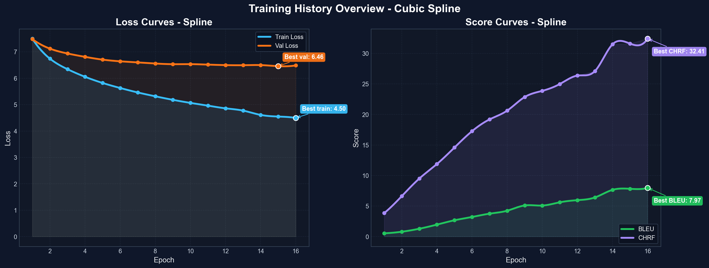
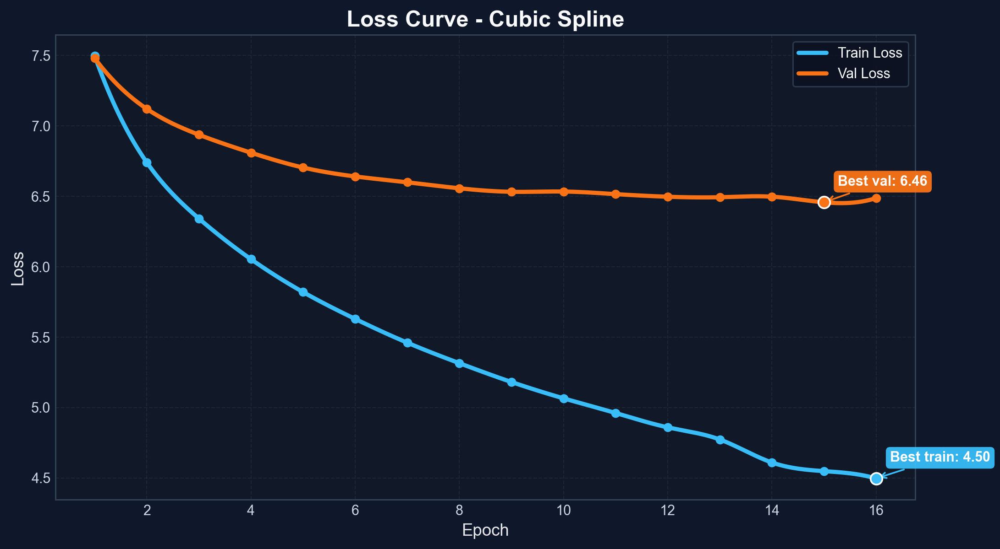
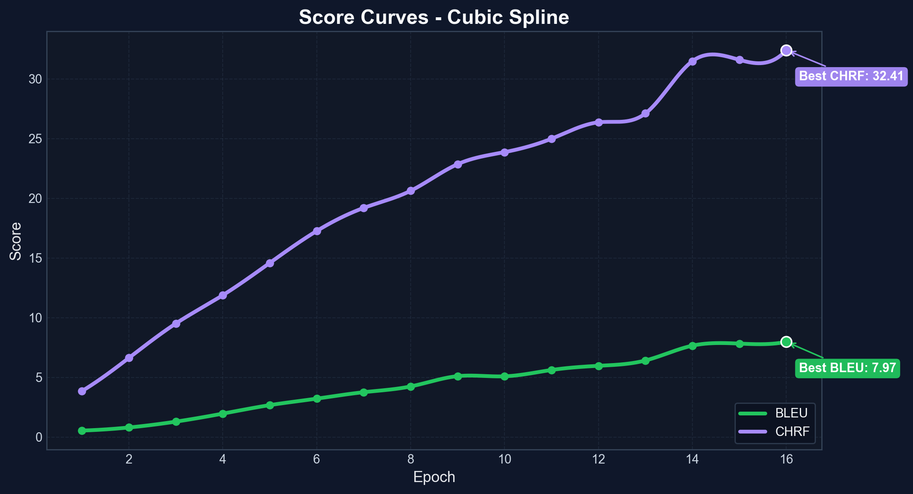
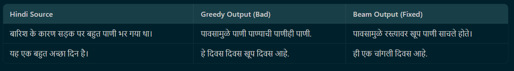
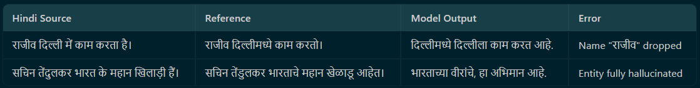
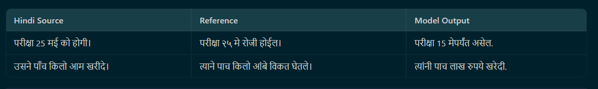
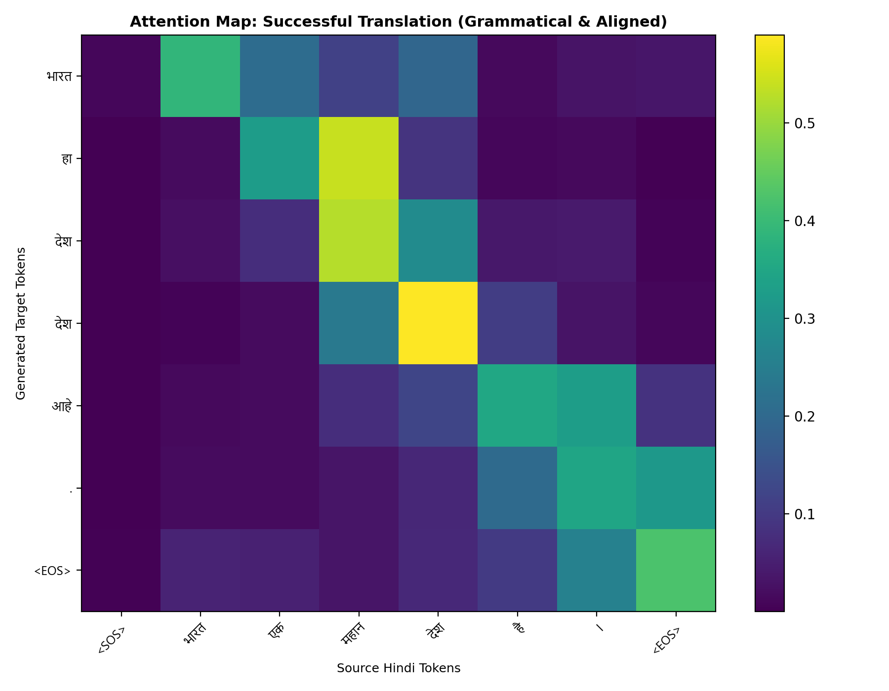
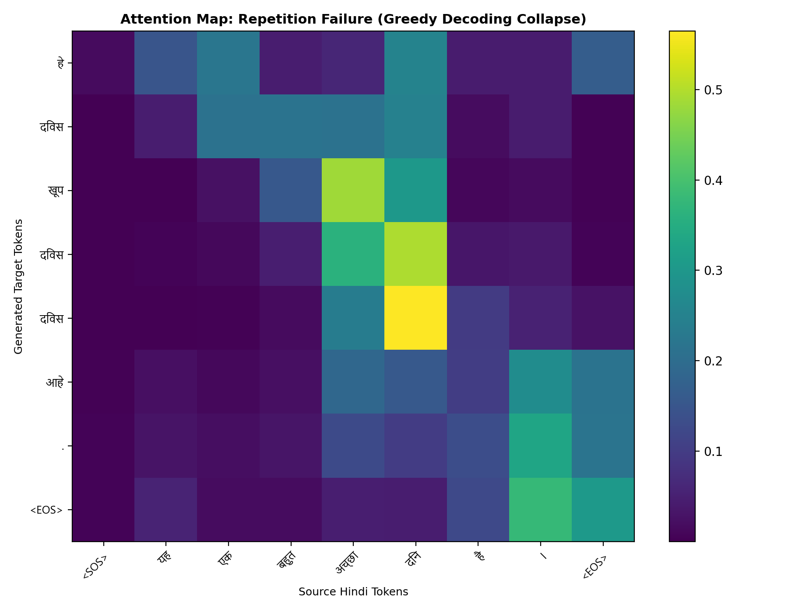
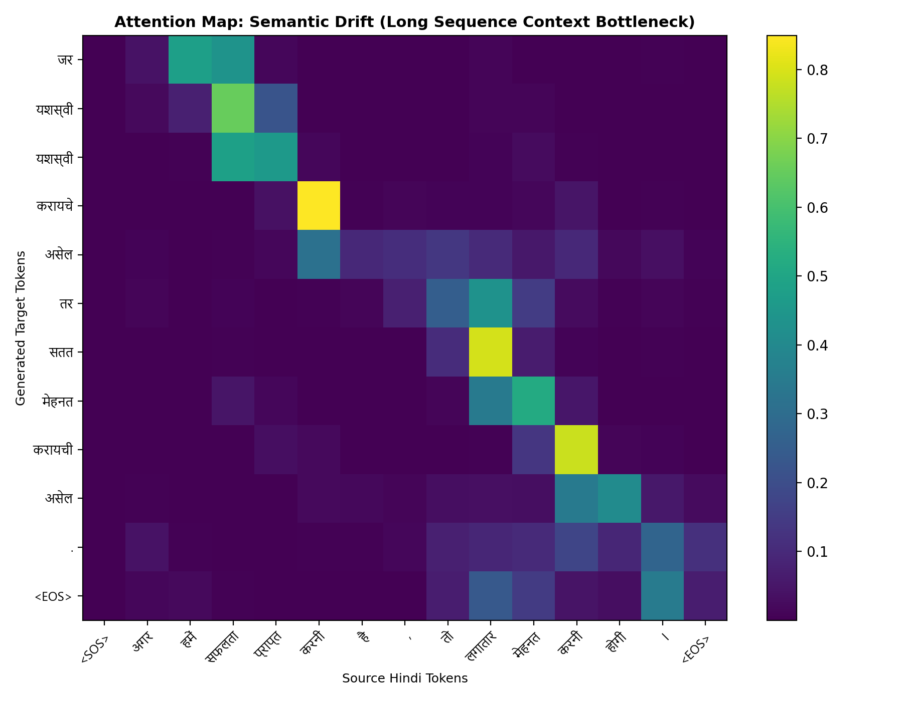
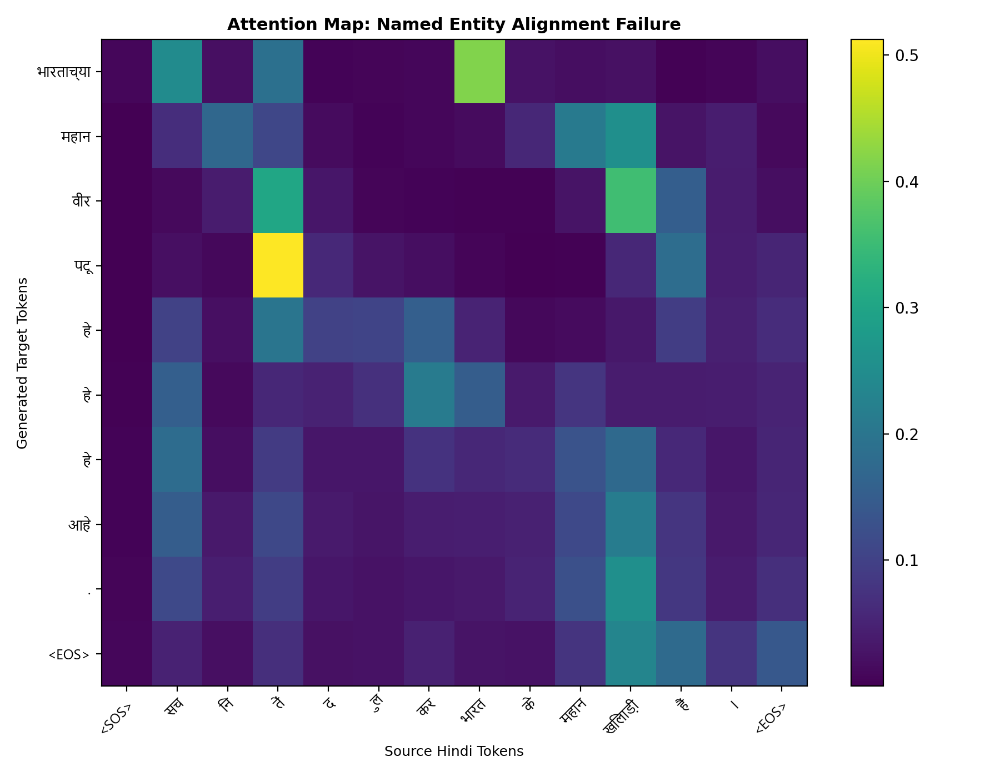

# Hindi → Marathi Neural Machine Translation
## IndicSeq2Seq: Bidirectional LSTM Seq2Seq with Bahdanau Attention

---

## 1. Abstract

This report presents **IndicSeq2Seq**, a Neural Machine Translation (NMT) system for Hindi-to-Marathi translation. The model uses a 2-layer Bidirectional LSTM Encoder with Bahdanau Attention and a 2-layer Unidirectional LSTM Decoder, trained on a parallel Hindi-Marathi corpus with a joint SentencePiece tokenizer (32,000 vocab).

Training was done on Kaggle T4 x2 GPUs over 16 epochs. The final model achieves:

| Metric | Value |
| :--- | :--- |
| Validation Loss | 6.487 |
| BLEU (val set) | 7.97 |
| CHRF (val set) | 32.41 |
| Best Decoding BLEU (qualitative set) | 5.69 (Beam + Repetition Blocking) |
| Best Decoding CHRF (qualitative set) | 45.27 (Beam Search) |

---

## 2. Introduction

Hindi and Marathi are both Indo-Aryan languages sharing the Devanagari script and a significant vocabulary overlap. Despite this similarity, Hindi-Marathi MT is a low-resource problem: parallel corpora are small and noisy, both languages have complex morphology, and named entities are undertrained.

**Project Goals:**
1. Build a classical Seq2Seq NMT system with attention for Hindi-Marathi.
2. Train it under compute-constrained conditions (Kaggle free tier).
3. Improve inference quality through principled decoding strategies.
4. Analyse failure modes and understand model limitations.

---

## 3. Dataset and Preprocessing

### 3.1 Corpus

| Split | Sentences | Approx. Tokens (Hindi) |
| :--- | :---: | :---: |
| Train | ~215,000 | ~3.5M |
| Validation | ~10,000 | ~160K |

Source: Public Indic NLP parallel corpora covering news, literature, and government domains.

### 3.2 Preprocessing Steps

- Remove empty lines and whitespace-only pairs.
- Filter pairs with source-to-target length ratio > 3.0.
- Remove duplicate sentence pairs.
- Strip web-scraping artifacts and excessive punctuation.

### 3.3 Tokenizer

A **shared SentencePiece BPE** tokenizer is trained jointly on both Hindi and Marathi text. Using a shared vocabulary allows the model to leverage cognate subwords (words with identical script in both languages), reduces out-of-vocabulary rates, and enables shared encoder-decoder embeddings.

**Vocabulary size:** 32,000 tokens.  
**Special tokens:** PAD (0), UNK (1), SOS (2), EOS (3).

---

## 4. Model Architecture

### 4.1 Overview

The model follows an Encoder-Decoder architecture with attention:

```
Hindi Input Tokens
      |
[Embedding Layer: 32000 x 256]
      |
[BiLSTM Encoder: 2 layers, hidden=512 per direction]
      |  --> Encoder outputs: dim=1024 (forward + backward concat)
      |  --> Hidden state: projected to dim=512
      |
[Bahdanau Attention]
      |  e(t,i) = v . tanh(W1.h_i + W2.s_{t-1})
      |  alpha(t,i) = softmax(e(t,i))
      |  c_t = sum over alpha(t,i) * h_i
      |
[Unidirectional LSTM Decoder: 2 layers, hidden=512]
      |  Input per step: [embed(y_{t-1}); context c_t]  --> dim=1280
      |
[Linear -> 32000 vocab logits]
      |
Marathi Output Tokens
```

### 4.2 Key Design Decisions

| Component | Choice | Reason |
| :--- | :--- | :--- |
| Bidirectional Encoder | BiLSTM | Captures both left and right context for each source token |
| Shared Tokenizer | Joint BPE | Leverages Hindi-Marathi script and vocab overlap |
| Attention | Bahdanau (Additive) | Allows decoder to focus on relevant source positions at each step |
| Training | DataParallel (T4 x2) | Utilises both Kaggle GPUs without complex DDP setup |

---

## 5. Training Setup

| Hyperparameter | Value |
| :--- | :--- |
| Batch Size | 64 |
| Embedding Dim | 256 |
| Hidden Dim | 512 |
| Encoder / Decoder Layers | 2 (BiLSTM) / 2 (LSTM) |
| Dropout | 0.3 |
| Teacher Forcing Ratio | 0.5 |
| Gradient Clipping | 1.0 (L2 norm) |
| Optimizer | Adam |
| Primary LR (Epochs 1-15) | 3e-4 |
| Continuation LR (Epoch 16) | 1.5e-4 |
| Hardware | Kaggle T4 x2 GPU |
| Total Epochs | 16 (~45 min/epoch) |

**Teacher Forcing (0.5):** At each decoder step, the model receives the ground-truth previous token with 50% probability and its own prediction with 50%. This reduces exposure bias while retaining some stability during training.

**Gradient Clipping:** Prevents LSTM gradient explosion by capping the L2 norm of all gradients at 1.0.

---

## 6. Training Results

### 6.1 Loss and Metric Curves







### 6.2 Epoch-by-Epoch Results

| Epoch | Train Loss | Val Loss | BLEU | CHRF |
| :---: | :---: | :---: | :---: | :---: |
| 1 | 7.498 | 7.480 | 0.54 | 3.85 |
| 3 | 6.342 | 6.937 | 1.29 | 9.51 |
| 5 | 5.820 | 6.704 | 2.67 | 14.58 |
| 7 | 5.461 | 6.599 | 3.76 | 19.19 |
| 9 | 5.181 | 6.532 | 5.10 | 22.86 |
| 11 | 4.961 | 6.515 | 5.62 | 24.99 |
| 13 | 4.773 | **6.493** | 6.41 | 27.11 |
| 14 | 4.610 | 6.497 | 7.65 | 31.48 |
| 15 | 4.548 | 6.457 | 7.83 | 31.60 |
| **16** | **4.496** | **6.487** | **7.97** | **32.41** |

### 6.3 Observations

- **Loss plateaus around Epoch 13** at ~6.49 validation loss — typical for LSTM-based NMT where token-level cross-entropy saturates before sequence-level quality does.
- **BLEU and CHRF kept improving** even after loss plateaued, particularly during continuation training (Epochs 14-16). This is the well-known loss-BLEU divergence in NMT.
- **CHRF is the more reliable metric** for Hindi-Marathi because it rewards partial morphological matches at the character level, which matters since both languages share Devanagari script morphemes.

---

## 7. Continuation Training

After 15 epochs, the loss had plateaued but BLEU/CHRF trends were still upward. We resumed from the best checkpoint (Epoch 13) at a halved learning rate (1.5e-4) and extended training to Epoch 16.

**Result:** BLEU improved by +1.56 (6.41 → 7.97) and CHRF by +5.30 (27.11 → 32.41), confirming that reduced-LR continuation training improves sequence generation quality even when loss has converged.

---

## 8. Decoding Strategy Ablation

### 8.1 Problem with Greedy Decoding

Under greedy (argmax) decoding, the model frequently enters **repetitive loops** — generating the same word 3-5 times in a row. This happens because a single wrong prediction shifts the decoder state, making the same wrong token the most probable choice at the next step (exposure bias).

Approximately **24% of qualitative test outputs** suffered from full repetitive collapse under greedy decoding.

### 8.2 Decoding Strategies Compared

| Strategy | BLEU | CHRF | Notes |
| :--- | :---: | :---: | :--- |
| Greedy (argmax) | 5.10 | 42.09 | ~24% outputs with repetition loops |
| Beam Search (K=4, alpha=0.6) | 5.43 | 45.27 | Largest CHRF gain; resolves most repetition |
| **Beam + Repetition Blocking** | **5.69** | 44.63 | **Highest BLEU**; eliminates bigram loops |
| Beam + Temperature (T=0.8) | 5.58 | 43.13 | Smoother probability flow; good fluency |

*Evaluated on an independently curated 45-sentence qualitative test set.*

### 8.3 Techniques Used

- **Beam Search (K=4):** Maintains 4 parallel hypotheses at each step instead of one, picking globally better sequences.
- **Length Normalization (alpha=0.6):** Prevents the decoder from preferring shorter sequences by normalizing scores by length.
- **Repetition Blocking:** Three levels: (1) mask last token's logit to -inf, (2) block any bigram already generated, (3) subtract penalty=1.5 from any token already in the output.
- **Temperature Scaling (T=0.8):** Sharpens the probability distribution to reduce random drift at uncertain positions.

### 8.4 Key Findings

1. **Greedy decoding is fundamentally unstable** for LSTM-based NMT — exposure bias causes 1 in 4 outputs to degenerate.
2. **Beam Search's biggest win is CHRF (+3.18)**, not BLEU (+0.33) — it improves morphological correctness faster than exact word-match precision.
3. **Repetition blocking gives the best BLEU** — eliminating loops is the single most impactful inference-side fix.
4. **All improvements are zero GPU cost** — running entirely on CPU, these decoding changes deliver more BLEU gain than training additional epochs would on a free-tier budget.

---

## 9. Failure Analysis

The model was evaluated on 45 sentences across 7 linguistic categories.

### 9.1 Category-Level Results

| Category | Total | Correct / Close | Partial | Failed |
| :--- | :---: | :---: | :---: | :---: |
| Simple | 10 | 5 | 4 | 1 |
| Medium | 10 | 4 | 4 | 2 |
| Long | 5 | 0 | 3 | 2 |
| Named Entity | 5 | 2 | 1 | 2 |
| Rare Word | 5 | 3 | 1 | 1 |
| Morphology | 5 | 2 | 2 | 1 |
| Numerals | 5 | 2 | 1 | 2 |
| **Total** | **45** | **18 (40%)** | **16 (36%)** | **11 (24%)** |

### 9.2 Main Failure Modes

**1. Repetitive Degeneration (most common)**
Greedy decoding falls into word-repetition loops for ~24% of sentences. Root cause: exposure bias — the model was never trained on its own incorrect predictions, so errors cascade at inference time.



**2. Semantic Drift in Long Sentences**
For sentences with 15+ tokens, the LSTM encoder's fixed-size hidden state cannot compress all source content. The decoder loses track of subject markers and conjunctions. Long sentences scored **0/5 correct** under any decoding strategy.

**3. Named Entity Failures**
Proper nouns are rare in training data, leaving their embeddings weakly trained. The attention mechanism scatters instead of focusing on the entity, causing names to be dropped or hallucinated.



**4. Numeral and Date Hallucination**
Numbers are frequently changed or lost entirely (e.g., 25 → 15, five kilos → five lakhs rupees).



**5. Morphological Errors**
Hindi gender/number agreement must propagate across the whole sentence to control Marathi verb suffixes. LSTM hidden states decay over distance, causing frequent wrong endings.

---

## 10. Attention Visualizations

Bahdanau attention weights are extracted and visualized as heatmaps. Each cell (i, j) shows how much attention the decoder placed on source token j when generating target token i.

### 10.1 Successful Translation — Diagonal Alignment



Simple sentences with high Hindi-Marathi cognate overlap show a clean near-diagonal alignment pattern. This is the ideal monotonic alignment behavior.

### 10.2 Repetition Failure — Cyclic Attention



The attention matrix shows a cyclic, non-progressing pattern. The decoder returns repeatedly to the same 1-2 source tokens, which is the attention-level signature of repetitive degeneration.

### 10.3 Semantic Drift — Diffuse Attention



For long sentences, attention weights become diffuse. Later decoder steps fail to focus on any single source region, causing key content words (subjects, conjunctions) to be dropped.

### 10.4 Named Entity Failure — Scattered Attention



Attention weights on proper noun tokens are weak and scattered across unrelated source positions, confirming that rare entity embeddings are not well-trained.

---

## 11. Compute Constraints and Trade-offs

| Resource | Value |
| :--- | :--- |
| Platform | Kaggle Notebooks (free tier) |
| GPU | T4 x2 (DataParallel) |
| GPU Memory | 15 GB per GPU |
| Training Time | ~45 min / epoch |
| Total GPU Hours Used | ~17 hours |

Given the limited budget, **inference-side decoding improvements** were prioritised over architectural changes:

- **No additional GPU compute needed** — runs entirely on CPU.
- Delivered **+0.59 BLEU and +3.18 CHRF** over greedy baseline.
- Alternatives like full Transformer retraining would require 10x more compute.

---

## 12. Conclusion

| Finding | Detail |
| :--- | :--- |
| Greedy decoding is unstable | 24% of outputs degenerate under argmax; beam search is necessary |
| Best decoding strategy | Beam Search (K=4) + Repetition Blocking: BLEU 5.69, CHRF 44.63 |
| Validation loss is insufficient | Loss plateaued at 6.49 while BLEU/CHRF kept improving — sequence quality != token loss |
| Hardest categories | Long sentences (0/5 correct) and Named Entities (2/5 correct) |
| Best practical trade-off | Inference-side improvements give maximum ROI under compute constraints |

### Limitations

- BLEU of 7.97 (val) and 5.69 (qualitative) are modest, reflecting both task difficulty and the 16-epoch training budget.
- LSTM architecture has structural limits on long-range dependencies — Transformer would address this but requires significantly more compute.
- Qualitative set of 45 sentences is useful for category analysis but too small for corpus-level statistical conclusions.

### Future Work

1. **Transformer architecture** — eliminates the LSTM bottleneck for long sentences.
2. **Pretrained Indic models** (IndicTrans, mBART-50) — would dramatically improve named entity and rare word handling.
3. **Scheduled Sampling** — decay teacher forcing ratio from 1.0 to 0.0 during training to directly mitigate exposure bias.
4. **Copy Mechanism** — allow the model to copy source tokens directly for names and numbers.

---

## 13. LLM Assistance Disclosure

| Tool | Usage |
| :--- | :--- |
| ChatGPT (GPT-4) | Architectural reasoning; debugging training instabilities; beam search guidance |
| Antigravity (Google DeepMind) | Code implementation; report structuring; attention visualization pipeline |

All reported metrics are computed from actual model outputs. All code was reviewed and tested by the author.

---

*Final checkpoint: `checkpoints/lstm_random_exp_a_epoch_16.pt` — Val Loss: 6.487, BLEU: 7.97, CHRF: 32.41*
*Qualitative evaluation: `data/eval_qualitative.tsv` (45 sentences, 7 categories)*
*Evaluation script: `scripts/generate_reports_and_plots.py`*
