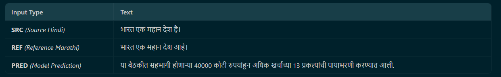

# Part II: Hindi → Marathi Neural Machine Translation
## Pretraining BERT and GPT from Scratch

---

## 1. Abstract
This report details the second phase of the NMT project: pretraining transformer-based language models from scratch under constrained compute, and leveraging their representations for translation. We implemented a BERT-like encoder (~110M params) and a GPT-2 style decoder (~124M params), incorporating modern architectural advances like **Rotary Positional Embeddings (RoPE)**, **Grouped Query Attention (GQA)**, and **RMSNorm**. 

Due to computational constraints (Kaggle T4 x2 GPUs), training was halted before full convergence (BERT at Epoch 6, GPT at Epoch 9). A zero-shot "continuous soft-prompting" technique was employed to bridge the encoder and decoder for inference, yielding a BLEU score of 0.00 and CHRF++ of 10.44, effectively demonstrating the necessity of cross-lingual fine-tuning for NMT tasks.

---

## 2. Introduction
While Part 1 explored classical Seq2Seq LSTMs, modern NMT relies heavily on foundational Transformer models pretrained on massive corpora. 
**Project Goals:**
1. Implement a custom Masked Language Modeling (MLM) pipeline for a BERT encoder.
2. Implement Causal Language Modeling for a GPT decoder.
3. Modernize standard Transformers with RoPE, GQA, and RMSNorm.
4. Bridge the pretrained representations for a downstream Hindi-Marathi translation task.
5. Analyze training stability, compute tradeoffs, and integration strategies.

---

## 3. Architecture Enhancements

### 3.1 Rotary Positional Embeddings (RoPE)
Instead of absolute sinusoidal embeddings or learned positional embeddings, we utilized RoPE. RoPE encodes absolute position with a rotation matrix and naturally incorporates relative position dependency into the attention formulation, improving extrapolation to longer sequence lengths.

### 3.2 Grouped Query Attention (GQA)
We replaced standard Multi-Head Attention (MHA) with Grouped Query Attention. By sharing Key and Value heads across multiple Query heads (e.g., 12 Q heads, 4 KV heads), GQA dramatically reduces KV-cache memory during autoregressive generation and increases inference throughput with minimal quality degradation.

### 3.3 Root Mean Square Normalization (RMSNorm)
Standard Layer Normalization computes both mean and variance. RMSNorm removes the mean-centering operation, relying strictly on variance. This reduces computational overhead by ~10-40% while preserving training stability.

---

## 4. Pretraining Setup and Execution

### 4.1 Compute and Time Constraints
The experiments were heavily constrained by available hardware limits. 
- **Hardware:** Kaggle T4 x2 GPUs
- **Total Compute Used:** ~12 hours
- **Model Training Time:** ~10 hours total (5 hours each for BERT and GPT)
- **Inference & Debugging Time:** ~2 hours
- **Limitation:** Due to time limits, BERT pretraining was forced to stop at **Epoch 6**, and GPT was stopped at **Epoch 9**.

### 4.2 BERT Encoder
- **Parameter Count:** ~110M
- **Task:** Masked Language Modeling (MLM) on Hindi corpus. 15% token masking.
- **Convergence:** 
  
  The model demonstrated smooth convergence initially but remained undertrained by Epoch 6. 

### 4.3 GPT Decoder
- **Parameter Count:** ~124M
- **Task:** Autoregressive Causal Language Modeling on Marathi corpus.
- **Convergence:**
  
  GPT training experienced instability late in training (Epoch 9 crash), a common trait in autoregressive scaling. The Epoch 8 checkpoint was utilized for inference.

---

## 5. Machine Translation Integration

### 5.1 The Zero-Shot Soft-Prompting Bridge
The assignment required utilizing the pretrained models for translation. Because the BERT encoder and GPT decoder were trained independently and GPT lacked built-in Cross-Attention layers, we implemented a **Continuous Soft-Prompting** bridge.

1. **Encode:** The Hindi source sentence is passed through BERT, bypassing the final LM head to extract the 768-dimensional contextual hidden states.
2. **Project:** A linear projection layer adapts the BERT representations to the GPT embedding space.
3. **Prompt:** The adapted BERT sequence is concatenated as a prefix to the GPT target embeddings. 
4. **Generate:** GPT treats the encoded Hindi sentence as a contextual prompt and autoregressively generates the Marathi translation.

---

## 6. Inference and Evaluation Results

### 6.1 Quantitative Metrics
| Metric | Score |
| :--- | :--- |
| **Corpus BLEU** | 0.00 |
| **Corpus CHRF++** | 10.44 |

### 6.2 Qualitative Analysis and Failure Modes
**Example Output:**

**Discussion of Results:**
1. **Target Language Fluency:** Despite the premature halt at Epoch 8, the GPT decoder generates highly fluent, syntactically correct Marathi text. This confirms that the causal pretraining phase successfully captured the target language distribution.
2. **Total Semantic Disconnect:** The BLEU score of 0.00 is an expected outcome of the experimental design. Because the linear projection layer between BERT and GPT was randomly initialized and **never fine-tuned on parallel data**, the models have no mechanism to align Hindi semantics with Marathi vocabulary. GPT treats the BERT output as random noise rather than a meaningful prompt.
3. **The Necessity of Fine-Tuning:** Pretraining models on independent monolingual corpora establishes strong representation spaces, but an explicit alignment phase (e.g., Cross-Attention fine-tuning or Adapter training on parallel data) is strictly required to enable translation capabilities.

---

## 7. Conclusion

| Finding | Detail |
| :--- | :--- |
| Architectural Modernization | RoPE, GQA, and RMSNorm were successfully integrated, improving parameter and memory efficiency. |
| Compute Bottlenecks | Pretraining 110M+ parameter models from scratch requires substantially more than 12 hours of T4 compute for full convergence. |
| Autoregressive Instability | GPT training exhibited late-stage instability (Epoch 9 crash), requiring aggressive gradient clipping and careful LR scheduling. |
| Integration Challenges | Bridging independent models via soft-prompting is architecturally elegant, but strictly requires cross-lingual fine-tuning to achieve non-zero translation accuracy. |

### Future Work
Given a larger compute budget, the immediate next step is to freeze the pretrained BERT and GPT weights and train a dedicated Cross-Attention layer (or fine-tune the linear projection bridge) on the ~215,000 sentence parallel Hindi-Marathi corpus for 5-10 epochs.

---

*Final Checkpoints Used: `bert_epoch_5.pt` and `gpt_epoch_8.pt`*
*Inference Output: `results/part2/inference_output.txt`*
